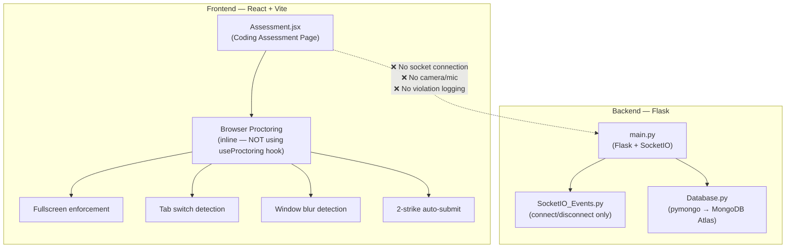
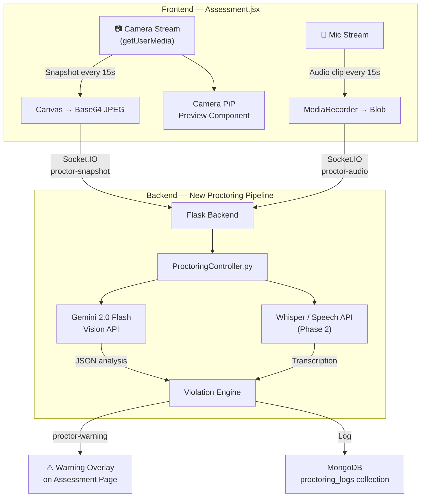
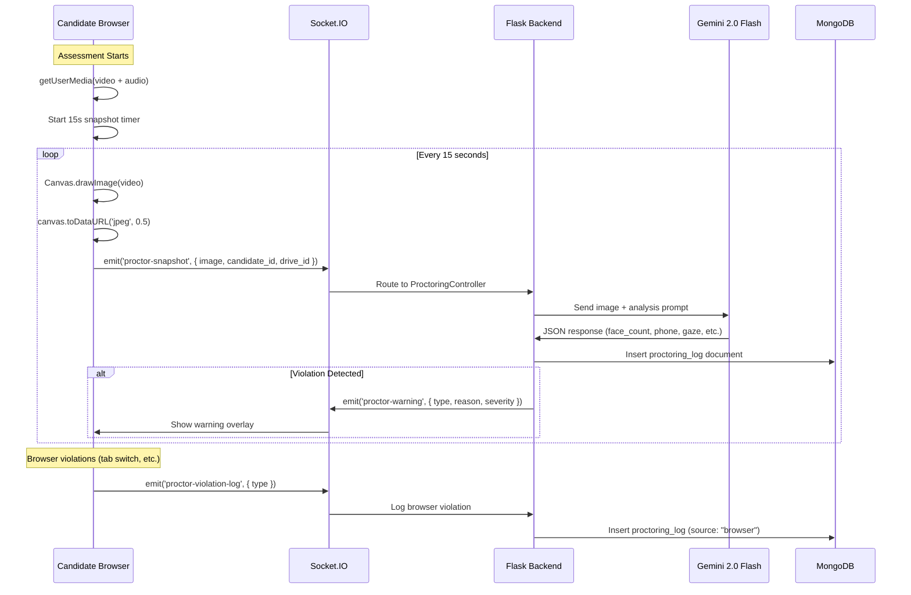

# Approach 2 Implementation Plan — Server-Side AI Proctoring (Gemini Vision)

> **Goal:** Integrate Gemini Vision-based AI proctoring into the existing HiRekruit coding assessment platform.

---

## Current Architecture Summary

After analyzing the codebase, here's what we're working with:



### Key Gaps Identified

| What's Missing                          | Detail                                                                                                                                                                                                                                                                              |
| --------------------------------------- | ----------------------------------------------------------------------------------------------------------------------------------------------------------------------------------------------------------------------------------------------------------------------------------- |
| ❌**No camera/mic in Assessment** | `getUserMedia` is only in [InterviewStartRoute.jsx](file:///c:/Users/Admin/Desktop/HiRekruit-code/frontend/src/pages/InterviewPages/InterviewStartRoute.jsx) (interview flow), NOT in [Assessment.jsx](file:///c:/Users/Admin/Desktop/HiRekruit-code/frontend/src/pages/Assessment.jsx) |
| ❌**No Socket.IO in Assessment**  | Assessment page has zero socket connection — violations are only local state                                                                                                                                                                                                       |
| ❌**No violation logging**        | Violations only update local`warningCount` state — nothing sent to backend/MongoDB                                                                                                                                                                                               |
| ❌**No Gemini SDK**               | `google-generativeai` is not in [requirements.txt](file:///c:/Users/Admin/Desktop/HiRekruit-code/backend/requirements.txt), no `GEMINI_API_KEY` in [.env](file:///c:/Users/Admin/Desktop/HiRekruit-code/backend/.env)                                                                 |
| ❌**Proctoring hook not used**    | [Assessment.jsx](file:///c:/Users/Admin/Desktop/HiRekruit-code/frontend/src/pages/Assessment.jsx) has inline proctoring code (L118-182) instead of using the [useProctoring](file:///c:/Users/Admin/Desktop/HiRekruit-code/frontend/src/Hooks/InterviewHooks/useProctoring.js) hook       |
| ❌**No proctoring controller**    | Backend[Controllers/](file:///c:/Users/Admin/Desktop/HiRekruit-code/backend/src/Controllers) has no proctoring-related files                                                                                                                                                           |

---

## What We'll Build



---

## Proposed Changes

### Component 1: Backend — Dependencies & Config

---

#### [MODIFY] [requirements.txt](file:///c:/Users/Admin/Desktop/HiRekruit-code/backend/requirements.txt)

Add Gemini SDK dependency:

```diff
+google-generativeai>=0.8.0
```

#### [MODIFY] [.env](file:///c:/Users/Admin/Desktop/HiRekruit-code/backend/.env)

Add Gemini API key:

```diff
+# Gemini AI for proctoring
+GEMINI_API_KEY=<your-gemini-api-key>
```

> [!IMPORTANT]
> You'll need to get a Gemini API key from [Google AI Studio](https://aistudio.google.com/apikey). The **Gemini 2.0 Flash** model costs ~₹6/candidate/hr at 15-second snapshot intervals.

---

### Component 2: Backend — Proctoring Controller (New)

---

#### [NEW] `backend/src/Controllers/ProctoringController.py`

This is the core new file — handles snapshot analysis via Gemini Vision:

```python
# What this file does:
# 1. Receives base64 JPEG snapshots from frontend via Socket.IO
# 2. Sends them to Gemini 2.0 Flash for analysis
# 3. Returns structured JSON with violation details
# 4. Logs every analysis to MongoDB proctoring_logs collection

Key functions:
├── analyze_snapshot(image_base64, candidate_id, drive_id)
│   └── Sends image to Gemini with proctoring prompt
│   └── Parses JSON response (face_count, phone_detected, looking_at_screen, etc.)
│   └── Returns violation dict or None
│
├── analyze_audio(audio_blob, candidate_id, drive_id)  # Phase 2
│   └── Transcribes audio via Whisper/Google Speech
│   └── Flags suspicious speech content
│
└── log_proctoring_event(candidate_id, drive_id, analysis_result)
    └── Inserts into MongoDB proctoring_logs collection
```

**Gemini Prompt Structure:**

```
Analyze this webcam image of a candidate taking a coding assessment.
Check for the following and respond ONLY in valid JSON:

{
  "candidate_visible": true/false,
  "face_count": <number>,
  "looking_at_screen": true/false,
  "phone_detected": true/false,
  "notes_or_books_visible": true/false,
  "suspicious_objects": true/false,
  "multiple_people": true/false,
  "confidence": 0.0 to 1.0,
  "violation_type": "<type or null>",
  "reason": "<explanation if suspicious>"
}
```

---

### Component 3: Backend — Socket.IO Proctoring Events (New)

---

#### [MODIFY] [SocketIO_Events.py](file:///c:/Users/Admin/Desktop/HiRekruit-code/backend/src/SocketIO/SocketIO_Events.py)

Add new proctoring socket event handlers:

```python
# NEW events to add:

@socketio.on("proctor-snapshot")
def on_proctor_snapshot(data):
    """
    Receives: { image: <base64 JPEG>, candidate_id, drive_id, timestamp }
    Calls ProctoringController.analyze_snapshot()
    Emits: 'proctor-warning' back to client if violation detected
    Logs: Every analysis to MongoDB
    """

@socketio.on("proctor-audio")  # Phase 2
def on_proctor_audio(data):
    """
    Receives: { audio: <blob>, candidate_id, drive_id, timestamp }
    Calls ProctoringController.analyze_audio()
    """

@socketio.on("proctor-violation-log")
def on_proctor_violation_log(data):
    """
    Receives browser-level violations from frontend
    (fullscreen exit, tab switch, window blur)
    Logs them to MongoDB for a complete audit trail
    """
```

---

### Component 4: Backend — MongoDB Schema

---

#### New Collection: `proctoring_logs`

```javascript
// MongoDB Document Structure
{
  _id: ObjectId,
  candidate_id: "string",
  drive_id: "string",
  timestamp: ISODate,
  
  // Source of the log
  source: "ai_vision" | "ai_audio" | "browser",  
  
  // For AI Vision analysis
  analysis: {
    candidate_visible: true,
    face_count: 1,
    looking_at_screen: true,
    phone_detected: false,
    notes_or_books_visible: false,
    suspicious_objects: false,
    multiple_people: false,
    confidence: 0.95,
    violation_type: null,
    reason: null
  },
  
  // For browser violations
  browser_violation_type: "tab_switch" | "fullscreen_exit" | "window_blur" | null,
  
  // Snapshot image (optional — store as base64 or Cloudinary URL)
  snapshot_url: "string or null",
  
  // Whether this triggered a warning
  warning_triggered: false,
  warning_severity: "low" | "medium" | "high" | null
}
```

> [!NOTE]
> We can use Cloudinary (already configured in .env) to store snapshots instead of base64 in MongoDB to keep document sizes small.

---

### Component 5: Frontend — AI Proctoring Hook (New)

---

#### [NEW] `frontend/src/Hooks/AssessmentHooks/useAIProctoring.js`

New hook for AI proctoring in the coding assessment:

```javascript
// What this hook does:
// 1. Requests camera + mic permissions (getUserMedia)
// 2. Maintains the media stream in a ref
// 3. Every 15 seconds: captures a canvas snapshot → emits via Socket.IO
// 4. Listens for 'proctor-warning' events from backend
// 5. Returns warning state for the overlay component

Hook API:
useAIProctoring({
  enabled: boolean,           // false for preview mode
  assessmentStarted: boolean, // only capture when assessment is active
  candidateId: string,
  driveId: string,
  snapshotInterval: 15000,    // ms between snapshots (default 15s)
  onViolation: (violation) => void,  // callback when AI detects violation
})

Returns:
{
  videoRef,              // ref to attach to hidden <video> element
  isStreamActive,        // boolean — camera is running
  isCameraAllowed,       // boolean — permission granted
  lastAnalysis,          // latest Gemini analysis result
  violations,            // array of all violations detected
  violationCount,        // total number of violations
  currentWarning,        // active warning to display (or null)
  dismissWarning,        // function to dismiss current warning
}
```

**Snapshot capture logic:**

```
Every 15 seconds:
  1. Draw video frame onto a 320×240 canvas (low res for speed)
  2. Export as JPEG at 50% quality (~15-30KB per snapshot)
  3. Emit via socket: { image: base64, candidate_id, drive_id, timestamp }
  4. Wait for 'proctor-warning' response
```

---

### Component 6: Frontend — Camera Preview Component (New)

---

#### [NEW] `frontend/src/components/CodingAssessment/CameraPreview.jsx`

Small picture-in-picture camera preview in the bottom-right of the assessment:

```
Features:
- Shows candidate's own camera feed (deterrent effect)
- Draggable position
- Minimize/collapse toggle
- Green border = normal, Red border = violation detected
- Small indicator showing "AI Monitoring Active"
```

---

### Component 7: Frontend — Assessment.jsx Integration

---

#### [MODIFY] [Assessment.jsx](file:///c:/Users/Admin/Desktop/HiRekruit-code/frontend/src/pages/Assessment.jsx)

Changes needed:

```diff
// 1. New imports
+import useAIProctoring from "../Hooks/AssessmentHooks/useAIProctoring";
+import CameraPreview from "../components/CodingAssessment/CameraPreview";

// 2. Initialize the hook (inside the component)
+const {
+  videoRef,
+  isStreamActive,
+  currentWarning,
+  dismissWarning,
+  violationCount: aiViolationCount,
+} = useAIProctoring({
+  enabled: assessmentStarted,
+  assessmentStarted,
+  candidateId: routeCandidateId,
+  driveId: routeDriveId,
+  onViolation: (violation) => {
+    // Integrate with existing warning system
+    handleProctoringViolation(violation.type);
+  },
+});

// 3. Add hidden video element + camera preview in JSX
+<video ref={videoRef} style={{ display: "none" }} />
+{assessmentStarted && isStreamActive && (
+  <CameraPreview videoRef={videoRef} hasViolation={!!currentWarning} />
+)}
```

#### Also: Log browser violations to backend

```diff
  const handleProctoringViolation = (type) => {
    if (!assessmentStarted || isSubmitting) return;
    // ... existing logic ...
  
+   // NEW: Log violation to backend via Socket.IO
+   if (socket) {
+     socket.emit("proctor-violation-log", {
+       candidate_id: routeCandidateId,
+       drive_id: routeDriveId,
+       violation_type: type,
+       timestamp: Date.now(),
+     });
+   }
  };
```

---

### Component 8: Backend — Recruiter Violation Review API

---

#### [NEW] `backend/src/Routes/proctoring_routes.py`

REST endpoint for recruiters to view proctoring results:

```python
GET /api/proctoring/violations/<drive_id>/<candidate_id>
# Returns all proctoring logs for a specific candidate in a drive

GET /api/proctoring/summary/<drive_id>
# Returns summary of all candidates' violations in a drive
# (for the recruiter dashboard)
```

---

## Data Flow — Complete Picture



---

## How Approach 3 (Hybrid) Builds on Top

If you later want to upgrade to Approach 3, here's what you'd add **on top of** Approach 2:

| Addition                                   | What Changes                                                                                                                | Effort        |
| ------------------------------------------ | --------------------------------------------------------------------------------------------------------------------------- | ------------- |
| **TensorFlow.js face detection**     | Add to`useAIProctoring` hook — run face detection every 2-3s client-side for instant "no face" / "multiple faces" alerts | +1 day        |
| **Client-side gaze tracking**        | Add Face Mesh model — 468 landmarks → head pose calculation                                                               | +1 day        |
| **Client-side audio monitoring**     | Web Audio API`AnalyserNode` for instant voice detection                                                                   | +0.5 day      |
| **Reduce server snapshot frequency** | Change from 15s → 30s (client handles fast checks, server handles deep analysis)                                           | Config change |
| **Cost reduction**                   | Server cost drops from ~₹6/hr → ~₹3/hr since snapshots are less frequent                                                 | Automatic     |

> [!TIP]
> The key insight is: **Approach 2 is NOT throwaway work.** Everything you build for Approach 2 (socket events, MongoDB logging, Gemini controller, camera hook, UI) is reused in Approach 3. You only ADD client-side TF.js on top.

---

## Files Summary

| File                                                                                                     | Action | Component                     |
| -------------------------------------------------------------------------------------------------------- | ------ | ----------------------------- |
| [requirements.txt](file:///c:/Users/Admin/Desktop/HiRekruit-code/backend/requirements.txt)                  | MODIFY | Add`google-generativeai`    |
| [.env](file:///c:/Users/Admin/Desktop/HiRekruit-code/backend/.env)                                          | MODIFY | Add`GEMINI_API_KEY`         |
| `backend/src/Controllers/ProctoringController.py`                                                      | NEW    | Gemini Vision analysis        |
| [SocketIO_Events.py](file:///c:/Users/Admin/Desktop/HiRekruit-code/backend/src/SocketIO/SocketIO_Events.py) | MODIFY | Add proctoring events         |
| `backend/src/Routes/proctoring_routes.py`                                                              | NEW    | Recruiter review API          |
| [main.py](file:///c:/Users/Admin/Desktop/HiRekruit-code/backend/main.py)                                    | MODIFY | Register proctoring blueprint |
| `frontend/src/Hooks/AssessmentHooks/useAIProctoring.js`                                                | NEW    | Camera/snapshot hook          |
| `frontend/src/components/CodingAssessment/CameraPreview.jsx`                                           | NEW    | PiP camera preview            |
| [Assessment.jsx](file:///c:/Users/Admin/Desktop/HiRekruit-code/frontend/src/pages/Assessment.jsx)           | MODIFY | Wire in AI proctoring         |

---

## Open Questions

**4. Warning policy:** Should AI violations (phone detected, looking away) follow the same 2-strike auto-submit as browser violations? Or should they have a separate, higher threshold (e.g., 3-4 AI warnings)?

**5. Scope:** Should we implement this for both the **coding assessment** (Assessment.jsx) and the **AI interview** (InterviewPage.jsx), or coding assessment only for now?

---

## Verification Plan

### Automated Tests

- Test Gemini API integration with sample images
- Test Socket.IO proctoring events (snapshot emit/receive)
- Test MongoDB proctoring_logs insertion

### Manual Verification

- Start a coding assessment → verify camera activates and snapshots are sent
- Hold up a phone → verify Gemini detects it and warning appears
- Look away from screen → verify gaze violation detected
- Switch tabs → verify both browser violation + AI analysis logged to MongoDB
- Check recruiter API endpoint returns correct violation data
