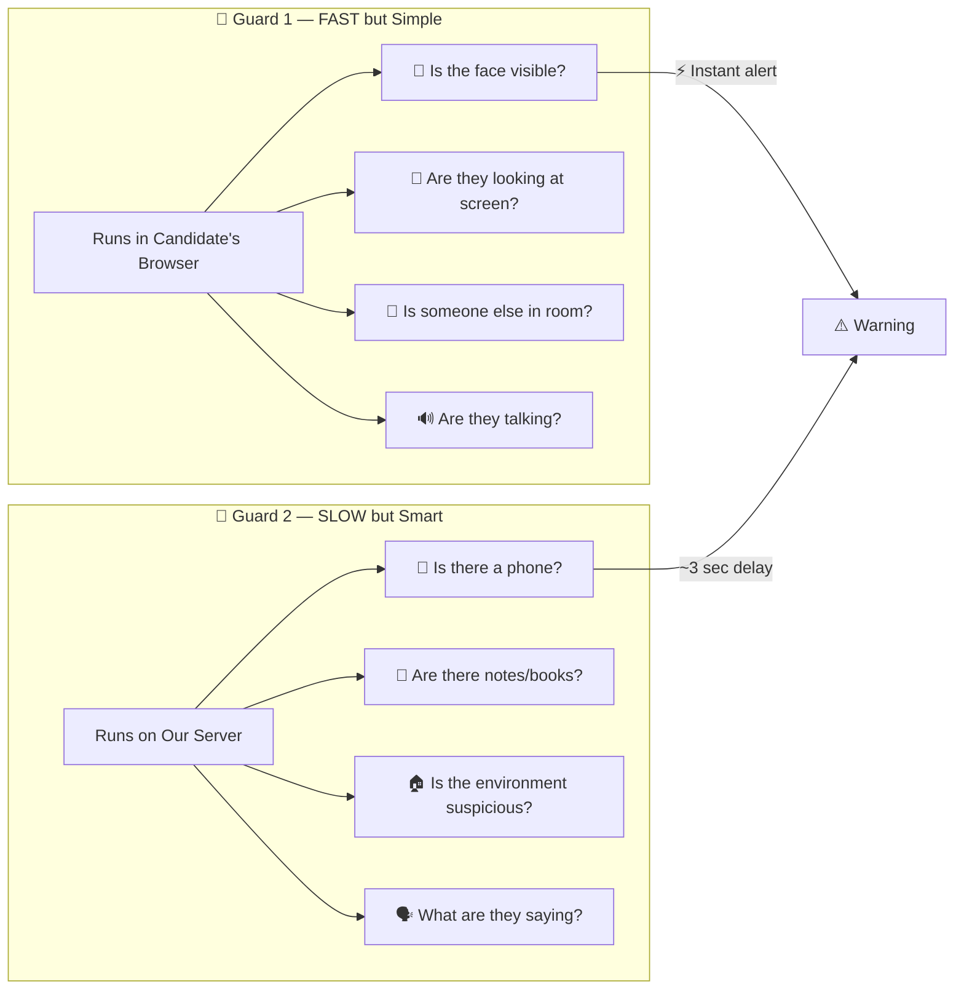
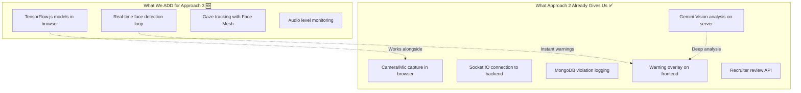

# Approach 3 (Hybrid) — Simple Explanation

> **One-liner:** Put a **fast guard** in the browser + a **smart guard** on the server. Together they catch everything.

---

## 🧠 The Simple Idea — Two Guards

Think of it like having **two security guards** watching the candidate:



|                             | 🏃 Guard 1 (Browser)             | 🧠 Guard 2 (Server)             |
| --------------------------- | -------------------------------- | ------------------------------- |
| **Technology**        | TensorFlow.js                    | Gemini Vision API               |
| **Where it runs**     | Candidate's computer             | Our Flask server                |
| **Speed**             | ⚡ Instant (every 2-3 sec)       | 🕐 ~3 sec delay (every 30 sec)  |
| **What it's good at** | "Is the person there & looking?" | "What objects are around them?" |
| **Cost**              | Free                             | ~₹3/candidate/hour             |

---

## 🔨 How to Build It — Just 2 Layers on Top of Approach 2

Here's the key insight: **Approach 3 = Approach 2 + TensorFlow.js in the browser**

If we already built Approach 2 (Gemini on server), then for Approach 3 we just **add** client-side AI. Nothing gets thrown away.



---

## 🪜 Step-by-Step: What Happens When a Candidate Takes the Assessment

```
CANDIDATE OPENS ASSESSMENT
        │
        ▼
┌─────────────────────────────┐
│  1. Camera & Mic turn ON    │
│  2. TensorFlow.js models    │
│     download (~5-10MB,      │
│     cached after first time)│
│  3. 10-second grace period  │
│     (no violations yet)     │
└─────────────────────────────┘
        │
        ▼
   ASSESSMENT BEGINS
        │
        ├──── Every 2-3 seconds (Guard 1 — Browser) ────┐
        │                                                 │
        │     📷 Grab camera frame                        │
        │     👤 Run face detection → face count          │
        │     👀 Run face mesh → where are they looking?  │
        │     🔊 Check mic volume → anyone talking?       │
        │                                                 │
        │     ✅ All OK → do nothing                      │
        │     ❌ Problem → INSTANT warning on screen      │
        │                                                 │
        ├──── Every 30 seconds (Guard 2 — Server) ───────┐
        │                                                 │
        │     📸 Take a snapshot (low quality JPEG)       │
        │     📤 Send to server via Socket.IO             │
        │     🧠 Gemini analyzes: phone? notes? books?    │
        │     📥 Server sends back result                 │
        │                                                 │
        │     ✅ All OK → log to MongoDB                  │
        │     ❌ Problem → warning + log to MongoDB       │
        │                                                 │
        ▼
   ASSESSMENT ENDS
        │
        ▼
┌─────────────────────────────┐
│  Recruiter can review:      │
│  • All flagged violations   │
│  • Snapshot evidence        │
│  • Timeline of events       │
└─────────────────────────────┘
```

---

## 🧩 What Goes Where in Our Code

### In the Browser (React Frontend)

```
useAIProctoring.js hook does EVERYTHING:

  ┌─────────────────────────────────────────┐
  │                                         │
  │  📷 Camera Stream (getUserMedia)        │
  │       │                                 │
  │       ├──→ TensorFlow.js (every 2-3s)   │  🆕 NEW for Approach 3
  │       │    • Face detection             │
  │       │    • Face mesh (468 landmarks)  │
  │       │    • Gaze direction check       │
  │       │    → Instant warning if problem │
  │       │                                 │
  │       └──→ Snapshot (every 30s)         │  ✅ Already in Approach 2
  │            • Canvas → JPEG              │
  │            • Send to server             │
  │            → Wait for Gemini result     │
  │                                         │
  │  🎤 Mic Stream                          │
  │       │                                 │
  │       ├──→ Web Audio API (continuous)   │  🆕 NEW for Approach 3
  │       │    • Check volume level         │
  │       │    → Warn if talking detected   │
  │       │                                 │
  │       └──→ Audio clip (every 30s)       │  ✅ Already in Approach 2
  │            • Send to server             │
  │            → Whisper transcription       │
  │                                         │
  └─────────────────────────────────────────┘
```

### On the Server (Flask Backend)

```
Same as Approach 2, NO changes needed:

  ProctoringController.py
    • Receives snapshots from browser
    • Sends to Gemini Vision API
    • Logs results to MongoDB
    • Sends warnings back via Socket.IO
```

> [!TIP]
> **The server side is IDENTICAL to Approach 2.** The only difference is that snapshots arrive every **30 seconds** instead of **15 seconds** (because the browser is handling the fast checks now). This **cuts the Gemini API cost in half**.

---

## 🎯 What Each Guard Catches — Complete Coverage

| Cheating Method                  | 🏃 Guard 1 (Browser) | 🧠 Guard 2 (Server)      | Response Time |
| -------------------------------- | -------------------- | ------------------------ | ------------- |
| Candidate leaves the frame       | ✅ Catches it        | ✅ Also catches it       | ⚡ Instant    |
| Multiple people visible          | ✅ Catches it        | ✅ Also catches it       | ⚡ Instant    |
| Looking away from screen         | ✅ Catches it        | ✅ Also catches it       | ⚡ Instant    |
| Talking / voice detected         | ✅ Catches it        | ✅ Also catches it       | ⚡ Instant    |
| **Phone in view**          | ❌ Can't see it      | ✅**Only Guard 2** | 🕐 ~30 sec    |
| **Notes / books visible**  | ❌ Can't see it      | ✅**Only Guard 2** | 🕐 ~30 sec    |
| **Suspicious environment** | ❌ Can't see it      | ✅**Only Guard 2** | 🕐 ~30 sec    |
| **What they're saying**    | ❌ Only volume       | ✅**Only Guard 2** | 🕐 ~30 sec    |
| Tab switching                    | ✅ Browser API       | —                       | ⚡ Instant    |
| Fullscreen exit                  | ✅ Browser API       | —                       | ⚡ Instant    |

**Result: 98% cheating coverage** — nothing gets through both guards.

---

## 💰 Cost Comparison

|                               | Approach 2 (Server Only) | Approach 3 (Hybrid)   |
| ----------------------------- | ------------------------ | --------------------- |
| Server snapshots              | Every**15 sec**    | Every**30 sec** |
| Gemini API calls per hour     | 240                      | **120** (half!) |
| Cost per candidate (1hr)      | ~₹6                     | **~₹3**        |
| Client-side cost              | ₹0                      | ₹0                   |
| TensorFlow.js download        | —                       | ~5-10MB (cached)      |
| Extra RAM on candidate device | —                       | ~200-400MB            |

> **Hybrid is actually CHEAPER than Server-Only** because the browser handles the frequent checks, so we send fewer snapshots to Gemini.

---

*In simple terms: Approach 3 = "Let the browser handle the quick checks, let the server handle the smart checks."*
