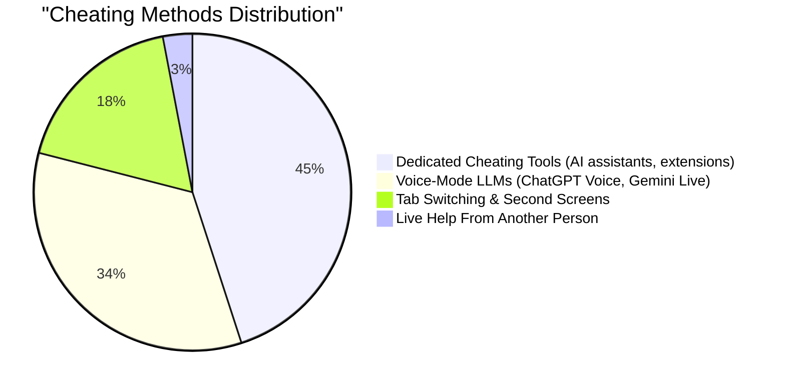
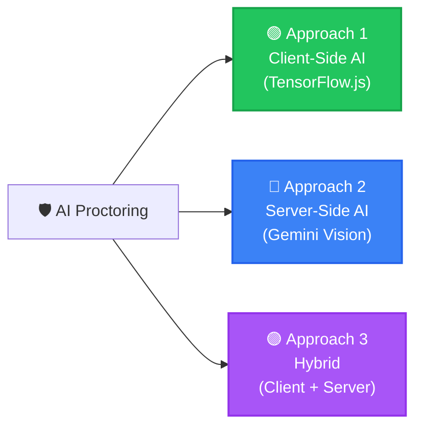
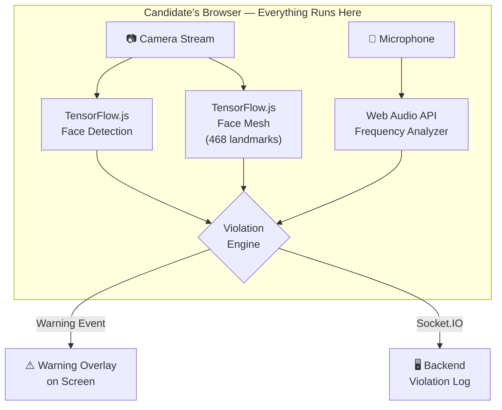
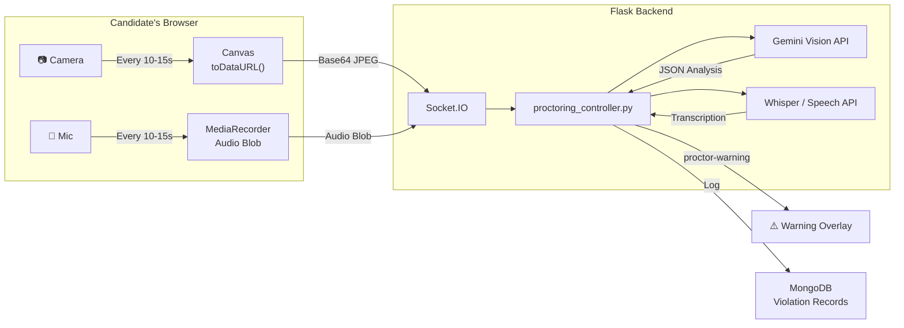
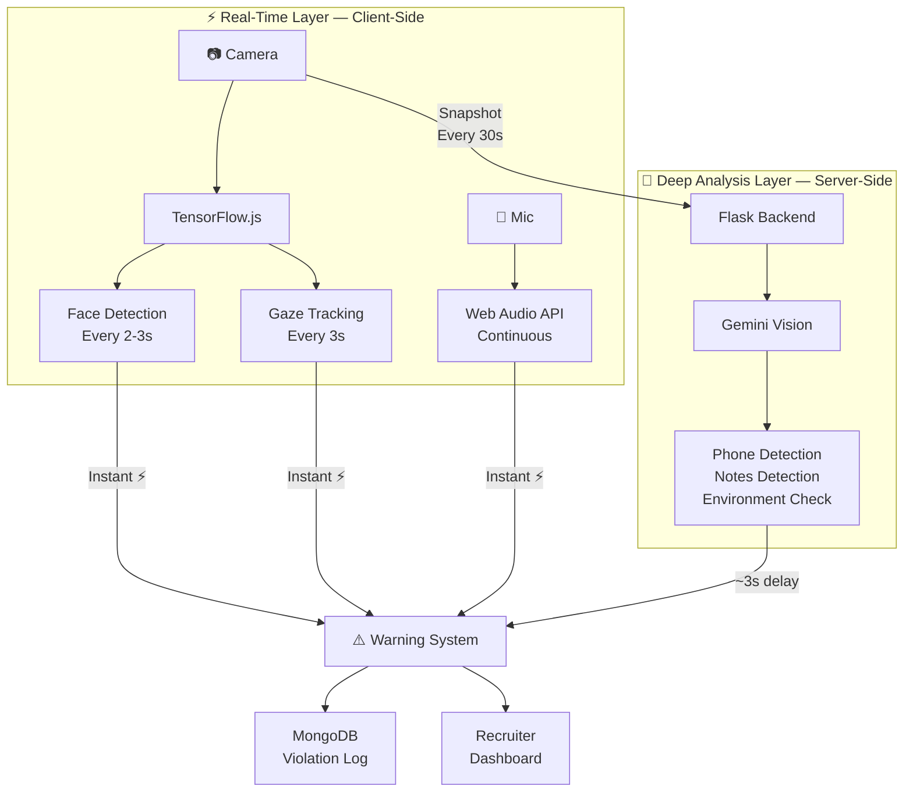

# 🛡️ AI-Powered Proctoring for HiRekruit

### Preventing Candidate Cheating in Coding Assessments

> **Prepared for:** HiRekruit Tech Team
> **Date:** June 2026
> **Status:** Ready for Review & Decision

---

## 📌 Executive Summary

HiRekruit currently has **browser-level proctoring** (fullscreen lock, tab-switch detection, copy-paste blocking). But candidates are still cheating using methods our browser checks **cannot see** — phones, voice assistants, second screens, and live human help.

This document outlines **3 practical approaches** to add AI-powered video & audio monitoring, with a clear recommendation on what to build first and what to add later.

> [!IMPORTANT]
> We already request camera & microphone permissions before assessments — but the streams are **discarded** and never used. This is our biggest gap and our biggest opportunity.

---

## 🎯 The Problem: How Candidates Cheat Today

### Cheating Breakdown by Category



### What We Can vs. Can't Detect Today

| Cheating Behavior                 | Can We Detect It?                    | How Serious? |
| --------------------------------- | ------------------------------------ | ------------ |
| Switching tabs / alt-tabbing      | ✅**Yes** — Browser API       | 🟡 Medium    |
| Exiting fullscreen                | ✅**Yes** — Fullscreen API    | 🟡 Medium    |
| Copy/paste from problem area      | ✅**Yes** — Event blocking    | 🟡 Medium    |
| Opening DevTools                  | ✅**Yes** — Size differential | 🟡 Medium    |
| Looking at notes / second screen  | ❌**No**                       | 🔴 High      |
| Another person helping off-screen | ❌**No**                       | 🔴 High      |
| Talking to someone / voice help   | ❌**No**                       | 🔴 Critical  |
| Using a phone to search answers   | ❌**No**                       | 🔴 Critical  |
| Candidate leaving the frame       | ❌**No**                       | 🔴 High      |
| Pasting code from external source | ❌**No**                       | 🔴 Critical  |

> [!CAUTION]
> **82% of cheating methods** (voice LLMs, cheating tools, live help) happen **outside the browser** — our current system is completely blind to them.

### The Core Insight: Only 2 Ways to Cheat Externally

When we strip away the complexity, candidates cheating from an **external source** (not the assessment device itself) can only receive help through **two channels** — their **ears** (someone dictating / audio help) or their **eyes** (reading off a second screen, phone, or notes). AI proctoring must cover both.


**Key takeaway from above:** For cheating on the **same device**, our existing browser proctoring (screen monitoring, tab detection) already handles it. For cheating via **external sources**, we need AI to act as both **ears** (audio monitoring) and **eyes** (gaze/face tracking — 97.4% accuracy for detecting off-screen reading).

---

### The Solution: AI-Powered Remote Proctoring (90-95% Detection Rate)

After evaluating multiple strategies, our team assessment is that **AI-powered remote proctoring is the most practical approach** to integrate into HiRekruit. It uses AI and machine learning to monitor candidates through webcam and microphone — and across all detection capabilities combined, it achieves **90-95% overall detection accuracy**.

| Capability                     | What It Does                                                                   | Accuracy      |
| ------------------------------ | ------------------------------------------------------------------------------ | ------------- |
| 👤**Facial Recognition** | Verifies identity, detects impersonation, monitors for multiple people         | **98%** |
| 👀**Eye Tracking**       | Identifies when candidates look away (reading notes, using phones)             | **92%** |
| 🔊**Audio Monitoring**   | Detects voices (conversations, voice assistance), suspicious background noise  | **89%** |
| 📱**Object Detection**   | Recognizes unauthorized devices (phones, tablets, notes, books) in camera view | **87%** |
| 🖥️**Screen Recording** | Detects tab switching, copy-paste, unauthorized applications                   | **95%** |
| 🤖**Behavior Analysis**  | Flags unusual patterns (excessive looking away, suspicious hand movements)     | **91%** |

> [!NOTE]
> Tab-switch monitoring alone catches only **18%** of cheating methods. Adding behavioral signal analysis (face, gaze, audio, object detection) covers the remaining **82%**. This is why AI proctoring is essential.

The question is not *whether* to implement AI proctoring, but *how*. Below we evaluate three practical approaches.

---

## 🏗️ Three Approaches to Implement This

We evaluated three viable approaches for HiRekruit. Each has different tradeoffs in terms of accuracy, cost, privacy, and implementation effort.



---

## 🟢 Approach 1 — Client-Side AI (TensorFlow.js)

### The Idea in One Line

> AI models run **entirely in the candidate's browser** — no video/audio ever leaves their device.

### How It Works



### What It Can Detect

| Detection                       | How It Works                                            | Accuracy |
| ------------------------------- | ------------------------------------------------------- | -------- |
| 👤**Facial Recognition**  | Face count = 0 (absent) or impersonation check          | ~98%     |
| 👥**Multiple people**     | Face count > 1                                          | ~98%     |
| 👀**Eye Tracking / Gaze** | Head pose from 468 facial landmarks                     | ~92%     |
| 🔊**Audio Monitoring**    | Audio frequency analysis (sustained volume)             | ~89%     |
| 😴**Eyes closed**         | Eye aspect ratio from landmarks                         | ~85%     |
| 🤖**Behavior Analysis**   | Unusual patterns (excessive look-aways, hand movements) | ~91%     |
| 📱~~Object Detection~~         | ❌ Not available client-side — needs server AI         | —       |
| 🖥️**Screen Activity**   | Already handled by browser-level proctoring             | ~95%     |

### Implementation Steps

```
Step 1 → Assessment starts
         └─→ getUserMedia({ video: true, audio: true })
         └─→ Load TF.js models (~5-10MB, cached after first load)

Step 2 → Every 2-3 seconds
         └─→ Capture video frame
         └─→ Run face detection → count faces
         └─→ Run face mesh → extract landmarks → calculate head pose
         └─→ If violation → increment warning → show overlay

Step 3 → Continuous audio monitoring
         └─→ Web Audio API reads frequency data
         └─→ If sustained voice > 3 seconds → trigger warning

Step 4 → On any violation
         └─→ socket.emit('proctor-warning', { type, timestamp })
         └─→ Backend logs to MongoDB
```

### ✅ Pros

| Benefit                       | Detail                                                        |
| ----------------------------- | ------------------------------------------------------------- |
| 🔒**Maximum Privacy**   | No images/audio ever leave the candidate's device             |
| ⚡**Instant Detection** | ~50-100ms per frame — truly real-time                        |
| 💰**Zero Cost**         | No API calls, no per-candidate charges                        |
| 🔌**Works Offline**     | After initial model download, no internet needed for analysis |
| 🔧**Easy Integration**  | Fits naturally into existing React + Socket.IO stack          |

### ❌ Cons

| Limitation                            | Detail                                         |
| ------------------------------------- | ---------------------------------------------- |
| 📱**Cannot detect phones**      | TF.js face models don't do object detection    |
| 📝**Cannot detect notes/books** | No scene understanding capability              |
| 💻**Heavy on client CPU**       | Uses ~200-400MB RAM + moderate CPU/GPU         |
| 📊**No evidence stored**        | No snapshots saved for recruiter review        |
| 🎯**Lower accuracy**            | Basic landmark math vs. full AI scene analysis |

### Cost & Timeline

| Metric                   | Value                                                                                                        |
| ------------------------ | ------------------------------------------------------------------------------------------------------------ |
| 💰 Cost per candidate    | **₹0 (Free)**                                                                                         |
| ⏱️ Implementation time | **3-4 days**                                                                                           |
| 📦 Bundle size added     | ~5-10 MB (cached)                                                                                            |
| 🔗 Dependencies          | `@tensorflow/tfjs`, `@tensorflow-models/face-detection`, `@tensorflow-models/face-landmarks-detection` |

---

## 🔵 Approach 2 — Server-Side AI (Gemini Vision API)

### The Idea in One Line

> Browser captures **periodic snapshots** → sends to our Flask backend → **Gemini Vision AI** analyzes them for cheating.

### How It Works



### What It Can Detect — Everything + More

| Detection                                 | How It Works                            | Unique Advantage                           |
| ----------------------------------------- | --------------------------------------- | ------------------------------------------ |
| 👤**All face/gaze checks**          | Gemini Vision image analysis            | Same as Approach 1                         |
| 📱**Phone / secondary device**      | Object detection in camera frame        | 🆕**Only server-side can do this**   |
| 📝**Written notes / cheat sheets**  | Object detection                        | 🆕**Only server-side can do this**   |
| 🏠**Suspicious environment**        | Scene analysis (mirrors, other screens) | 🆕**Only server-side can do this**   |
| 🗣️**Someone dictating answers**   | Speech-to-text via Whisper              | 🆕**Identifies actual words spoken** |
| 🖥️**Screen reflected on glasses** | Reflected screen detection              | 🆕**Advanced scene understanding**   |

### ✅ Pros

| Benefit                               | Detail                                                                      |
| ------------------------------------- | --------------------------------------------------------------------------- |
| 🎯**Highest Accuracy**          | Gemini Vision understands full scenes — phones, notes, people, environment |
| 💻**Light on Client**           | Browser only takes snapshots, all heavy AI runs on server                   |
| 📸**Evidence Storage**          | Every snapshot + AI analysis saved in MongoDB for recruiter review          |
| 🗣️**Speech Transcription**    | Can capture what is being said and flag suspicious speech                   |
| 📊**Recruiter Dashboard Ready** | Stored evidence enables post-assessment review                              |

### ❌ Cons

| Limitation                     | Detail                                                |
| ------------------------------ | ----------------------------------------------------- |
| ⏱️**2-5 second delay** | Not real-time — analysis takes time on cloud         |
| 🔒**Privacy concern**    | Candidate images sent to Google's servers             |
| 💰**Per-candidate cost** | Small but adds up at scale                            |
| 🌐**Needs internet**     | If connection drops, no analysis happens              |
| 📋**Consent required**   | Must explicitly inform candidates about image capture |

### Cost Analysis — Very Affordable with Gemini Flash

| Model                         | Cost per Image | Images per Hour (15s interval) | Cost per Candidate (1hr) |
| ----------------------------- | -------------- | ------------------------------ | ------------------------ |
| **Gemini 2.0 Flash** ⭐ | ~$0.0003       | 240                            | **~₹6**           |
| Gemini 2.5 Pro                | ~$0.003        | 240                            | ~₹60                    |
| GPT-4o Mini                   | ~$0.0005       | 240                            | ~₹10                    |
| GPT-4o                        | ~$0.005        | 240                            | ~₹100                   |

> [!TIP]
> **Recommended:** Use **Gemini 2.0 Flash** — it costs just **₹6 per candidate** for a full 1-hour assessment. That's less than the cost of a single SMS notification.

### Cost & Timeline

| Metric                      | Value                                        |
| --------------------------- | -------------------------------------------- |
| 💰 Cost per candidate (1hr) | **~₹6** (with Gemini Flash)           |
| ⏱️ Implementation time    | **3-4 days**                           |
| 📦 Backend changes          | New`proctoring_controller.py` + Gemini SDK |
| 🔗 API dependency           | Google Gemini API                            |

---

## 🟣 Approach 3 — Hybrid (Client + Server) ⭐ Recommended for Production

### The Idea in One Line

> **Real-time face/gaze/voice checks in the browser** + **periodic deep scene analysis via Gemini** = best of both worlds.

### How It Works



### What Runs Where — Clear Division of Labor

| Detection                    | Where It Runs                       | How Often  | Response Time |
| ---------------------------- | ----------------------------------- | ---------- | ------------- |
| Face presence (0 or missing) | 🟢**Client** — TensorFlow.js | Every 2s   | ⚡ Instant    |
| Multiple faces               | 🟢**Client** — TensorFlow.js | Every 2s   | ⚡ Instant    |
| Gaze / head direction        | 🟢**Client** — Face Mesh     | Every 3s   | ⚡ Instant    |
| Voice / talking              | 🟢**Client** — Web Audio API | Continuous | ⚡ Instant    |
| Tab / fullscreen violations  | 🟢**Client** — Browser APIs  | On event   | ⚡ Instant    |
| 📱 Phone in view             | 🔵**Server** — Gemini Vision | Every 30s  | ~3s           |
| 📝 Notes / books visible     | 🔵**Server** — Gemini Vision | Every 30s  | ~3s           |
| 🏠 Environment anomalies     | 🔵**Server** — Gemini Vision | Every 30s  | ~3s           |
| 🗣️ Speech content          | 🔵**Server** — Whisper       | Every 30s  | ~3s           |

### ✅ Pros

| Benefit                          | Detail                                                                                |
| -------------------------------- | ------------------------------------------------------------------------------------- |
| ⚡**Instant + Deep**       | Critical checks (face, gaze) are instant; deep checks (phone, notes) happen every 30s |
| 🎯**Maximum Detection**    | Covers ALL cheating methods with highest accuracy                                     |
| 💰**Cost Efficient**       | Snapshots only every 30s →**~₹3/candidate/hr**                                |
| 📸**Full Evidence Trail**  | Client + server violations all logged with snapshots                                  |
| 📊**Dashboard Ready**      | Recruiters can review flagged candidates with evidence                                |
| 🔧**Graceful Degradation** | If server is slow, client-side still works in real-time                               |

### ❌ Cons

| Limitation                          | Detail                                                                 |
| ----------------------------------- | ---------------------------------------------------------------------- |
| 🔧**Most Complex**            | Requires both frontend TF.js integration + backend Gemini controller   |
| ⏱️**Longest to Build**      | 5-7 days for full implementation                                       |
| 💻**Moderate Client Load**    | TF.js models running + periodic snapshot capture                       |
| 🔒**Partial Privacy Concern** | Periodic snapshots still sent to cloud (less frequent than Approach 2) |
| 🧪**More Testing Needed**     | Two detection layers need tuning to avoid duplicate warnings           |

### Cost & Timeline

| Metric                      | Value                                     |
| --------------------------- | ----------------------------------------- |
| 💰 Cost per candidate (1hr) | **~₹3** (snapshots every 30s)      |
| ⏱️ Implementation time    | **5-7 days**                        |
| 📦 Frontend changes         | TF.js hooks + snapshot capture            |
| 📦 Backend changes          | `proctoring_controller.py` + Gemini SDK |

---

## 📊 Head-to-Head Comparison

### Feature Comparison

| Feature                   | 🟢 Approach 1            | 🔵 Approach 2            | 🟣 Approach 3       |
| ------------------------- | ------------------------ | ------------------------ | ------------------- |
|                           | **Client-Side AI** | **Server-Side AI** | **Hybrid** ⭐ |
| Face detection            | ✅                       | ✅                       | ✅                  |
| Multiple person detection | ✅                       | ✅                       | ✅                  |
| Gaze / head tracking      | ✅                       | ✅                       | ✅                  |
| Voice / talking detection | ✅                       | ✅                       | ✅                  |
| 📱 Phone detection        | ❌                       | ✅                       | ✅                  |
| 📝 Notes / book detection | ❌                       | ✅                       | ✅                  |
| 🏠 Environment analysis   | ❌                       | ✅                       | ✅                  |
| 🗣️ Speech transcription | ❌                       | ✅                       | ✅                  |
| 📸 Evidence snapshots     | ❌                       | ✅                       | ✅                  |

### Rating Comparison

| Criteria                          | 🟢 Approach 1     | 🔵 Approach 2      | 🟣 Approach 3      |
| --------------------------------- | ----------------- | ------------------ | ------------------ |
| **Privacy**                 | ⭐⭐⭐⭐⭐        | ⭐⭐               | ⭐⭐⭐             |
| **Detection Accuracy**      | ⭐⭐⭐            | ⭐⭐⭐⭐⭐         | ⭐⭐⭐⭐⭐         |
| **Real-time Response**      | ⭐⭐⭐⭐⭐        | ⭐⭐               | ⭐⭐⭐⭐⭐         |
| **Cost**                    | ⭐⭐⭐⭐⭐ (Free) | ⭐⭐⭐⭐ (~₹6/hr) | ⭐⭐⭐⭐ (~₹3/hr) |
| **Client Performance**      | ⭐⭐ (Heavy)      | ⭐⭐⭐⭐⭐ (Light) | ⭐⭐⭐ (Moderate)  |
| **Implementation Effort**   | ⭐⭐⭐⭐ (Easy)   | ⭐⭐⭐ (Moderate)  | ⭐⭐ (Complex)     |
| **Evidence for Recruiters** | ⭐ (None)         | ⭐⭐⭐⭐⭐         | ⭐⭐⭐⭐⭐         |
| **Vendor Dependency**       | None              | Google/OpenAI      | Google/OpenAI      |
| **Offline Capability**      | ✅ Works          | ❌ Needs internet  | ⚠️ Partial       |

### Cost at Scale

| Scale                  | 🟢 Approach 1 | 🔵 Approach 2 | 🟣 Approach 3 |
| ---------------------- | ------------- | ------------- | ------------- |
| 100 candidates/month   | ₹0           | ₹600         | ₹300         |
| 500 candidates/month   | ₹0           | ₹3,000       | ₹1,500       |
| 1,000 candidates/month | ₹0           | ₹6,000       | ₹3,000       |
| 5,000 candidates/month | ₹0           | ₹30,000      | ₹15,000      |
